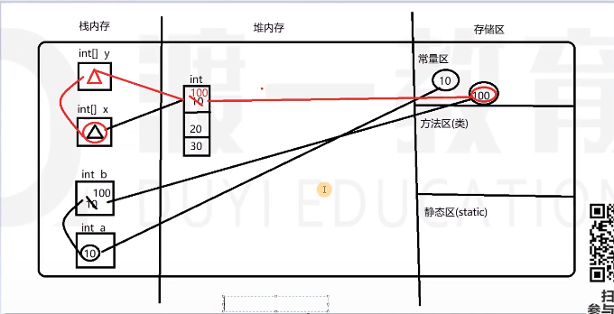

# 数组
数组是一组数据类型相同的数据的组合，将这些数据统一的管理起来

数组本身是一个引用数据类型，数组内存储的类型可以是基本类型也可以是引用类型
## 数组的定义（声明）与初始化
```java
//数据类型[] 数组名字
int[] array;

// 静态初始化（有长度，有元素）
int[] array = new int[]{10,20,30,40,50};
int[] array = {10,20,30,40,50}; // 推荐
// 取值
int value = array[0]; // 索引范围[0, length)
// 存值
array[0] = 25;

// 动态初始化(有长度，默认值)
// 整数-0；float/double-0.0; char-- 0; boolean -- false; 引用类型 -- null
int[] array = new int[5];
```
## 数组的遍历
```java
for(/*变量*/ : /*数组名*/) {

}

int[] array = {10,20,30,40,50}; // 推荐
for (int value : array) {

}
```
## 基本数据类型与引用数据类型在内存结构上的区别
### 代码解释
```java
// // 基本类型变量空间存储的是值 -- 传递的也是值（一个改变，另一个不变）
int a = 10;
int b = a;
b = 100; // a == 10;

// 变量x在栈内存中，存储的是数组x的首元素地址
// new 相减于在堆内存中申请开辟了一块新的空间
// 数组在堆内存的空间形态是一串连续的地址
// 引用类型变量空间存储的是地址（引用）-- 传递的是引用（一个改变，另一个也跟着改变）
int[] x = new int[]{10,20,30}
int[] y = x;
y[0] = 100; // x[0] == 100
```


### 特点
1. 数组本身是一个引用数据类型
2. 数组是在堆内存中是以一串连续的地址存在
3. 数组在初始化时必须指定长度
4. 堆内存的数组空间长度一旦确定，不能再次发生改变
5. 栈内存的变量中存储的是数组的地址引用
6. 数组内部存储的类型可以是基本数据类型也可以是引用数据类型
### 总结
1. 所有的变量空间都存储在**栈内存**中。
2. 变量空间可以存储**基本数据类型**，也可以存储**引用数据类型**
3. 如果变量空间存储的是基本数据类型，存储的是值（一个变量改变，另一个不会跟着改变）
4. 如果变量空间存储的是引用数据类型，存储的是引用（地址）（一个变量地址对应的值改变，另一个跟着改变）

