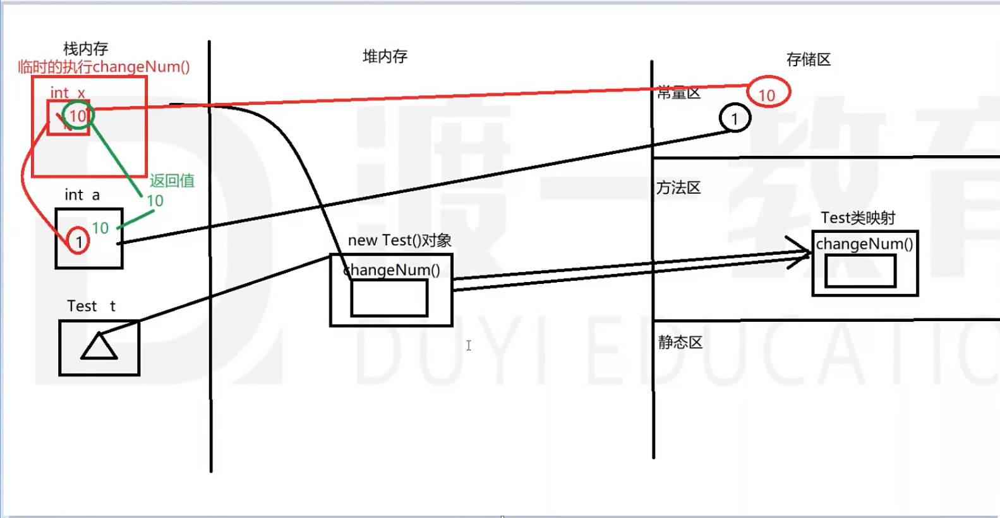
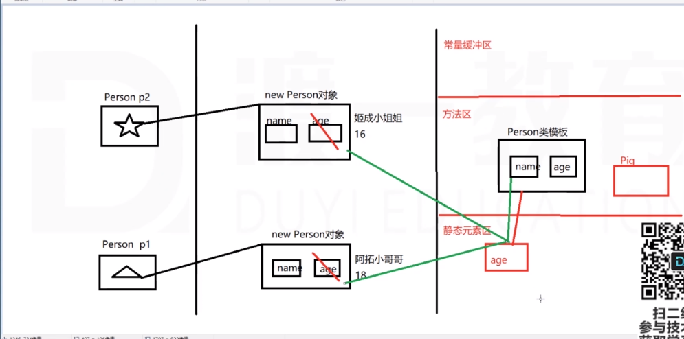

## 构造方法
```java
// 权限修饰符  类型一致的方法名([参数列表])[异常]{}
public Class Person {
   public String name;

   public Person() {}
   // 构造方法重载
   public Person(String name){
      this.name = name;
   }
}

// 通过new调用
Person p = new Person();
```
每个类都有构造方法，若在自己定义的类中没有定义，系统会默认提供一个无参数的构造方法。

若在自己的类中定义了构造方法，则默认无参的构造方法即被覆盖

构造方法
## 类属性
```java
/*权限修饰符 [特征修饰符] 数据类型 属性名字[ = 值]*/
public String name;
```

## 类方法
```java
// 权限修饰符 [特征修饰符] 返回值类型 方法名字([参数列表]) [抛出异常][{
//    [方法体]
// }]
```
类方法存储在**堆内存**的对象空间内。

类方法是在**栈空间**内执行的

形参与实参

形参可以理解为是方法执行时的临时变量空间(x)

实参可以理解为是方法调用时传递进去的参数(a)

方法调用时会将实参的内容传递给形参
1. 如果内容是基本类型，传递 - 值    形参改变，实参未变
2. 如果内容是引用类型：传递 - 引用  形参改变，实参也跟着改变


## 方法重载 - overload
1. 一个类中的一组方法，方法名相同，参数列表不同，构成了方法重载
2. 参数列表的不同：
   1. 参数的个数
   2. 参数的类型
   3. 参数的顺序
3. 动态参数列表
   ```java
   public void test(int ...x); // √ 类型固定，个数不固定[0...n], 本质上是一个数组int[] x;但不能与int[] x构成重载
   public void test(int a, int ...x); // √
   public void test(int[] x); // ×；与第1个冲突
   ```
   动态参数列表(```int ..x```)不能与```int[] x```不能构成重载。这两个本质上都是数组。

   区别：动态参数列表的方法，可以不传参数(相当于空数组)；数组的方法必须传递参数
## 程序块
1. 作用：跟普通方法一样
2. 写法：可以认为程序块是一个没有修饰符、没有参数、没有返回值、没有名字的特殊方法
   ```java
   public class Person {
      public String name;
      public constructor(String name) {
         this.name = name;
      }

      public String getName() {return this.name;}

      // 程序块
      {
         System.out.println("这是Person类的一个程序块");
      }
   }
   ```
3. 用法：程序块也需要调用才能执行（我们自己调用不到-没有名字）
   每一次我们调用构造方法之前，系统会帮助我们自动的调用一次程序块，让他执行一遍。

4. 类中可以有多个程序块
5. 使用场景：需要在创建对象之前（constructor）执行
## this关键字
1. this是一个关键字，代替的是某一个对象（当前调用属性或方法时的那个对象）
2. this可以调用属性、方法及**构造函数**
3. 可以在一个构造方法内通过```this()```调用另一个构造方法（省略了构造方法的名字）。必须在另一个构造方法内调用，必须在程序的第一行。
4. 构造方法、一般方法是有顺序的，认为构造方庄早于一般方法。
5. 不能在一般方法内调用构造方法
6. 构造方法可以重载
## 类与类之间的关系
### A is-a B 泛化(继承、实现)
#### 继承
1. 子类通过关键字``` extends```继承父类
2. 子类的对象可以调用父类中(```public/protect```)属性和方法。
   1. 构造方法严格意义来讲，不算子类继承过来的，只是单纯的在子类调用构造方法时默认调用父类的构造方法
   2. 程序块严格意义上来说，不算子类继承过来（子类自己调用不到-没名字）。程序块子类不能直接调用，子类执行构造方法之前默认调用了父类的构造方法，父类构造方法之前自动执行父类的块。
3. 子类可以添加自己的属性和方法
4. 子类从父类中继承过来的方法不能满足子类需要时，可以在子类中重写（覆盖）父类的方法。

   ||方法重写(override)|方法重载(overload)
   --|--|:--:|
   |类| 有继承关系的类,子类重写父类的方法 | 一个类中的一组方法 |
   权限 | 子类可以大于等于父类 | 没有要求 |
   final | 父类方法是final，子类不能重写|没有要求|
   static | 父类方法是static，子类不存在重写|没有要求|
   abstract | 父类是abstract 子类必须重写，否则子类也得是抽象类|没有要求|
   返回值|子类的返回值可以小于等于父类|没有要求|
   名字|子类与父类必须一致|一个类中的好多方法名必须一致
   参数|子类与父类必须一致|每一个方法的参数必须不一致(类型、个数、顺序)
   运行时异常|如果父类方法抛出运行时异常，子类可以不予理会| 没有要求
   编译异常|如果父类方法抛出编译时异常，子类抛出异常的个数少于等于父类，子类抛出异常的类型小于等于父类 | 没有要求
   方法体|

5. 每一个类都有继承类，如果不写```extends```关键字，则默认继承```Object```，如果写了```extends```则继承后面的那个类。
   
   可以理解为```Object```类是任何一个引用类型的父类（直接或间接的继承```Object```）。```Object```类没有父类。

   |Object中的方法|说明
   --|:--|
   |hashCode()|将对象在内存中的地址经过计算得到一个int整数|
   |equals()|用来比较两个对象内容,Object默认的比较效果是==；基本类型-比较值；引用类型-比较地址。equals是Object类中继承过来的方法，默认效果是比较地址。如果想要改变其规则，可以进行方法重写。
   |toString()| 打印输出时将一个对象变成字符串|
   |getClass()|获取对象对应类的类映射(反射)
   |wait()|线程进入挂起等待状态
   |notify()|线程唤醒
   |notifyAll()|唤醒所有
   |finalize()|protected，在对象被GC回收的时候，默认调用执行的方法。
   |clone()|protected 为了克隆对象
6. 在Java中是单继承-每一个类只能有一个继承类（在```extends```关键字只能写一个类）。

   可能通过传递的方式实现多继承的效果

   后续还会有多继承(**实现**)
7. 继承在内存中的存储形式
   
8. 关于this和super
   
   this和super代替的都是对象

   this指的是当前**执行方法时**的那个对象（注意区分当前类的对象）

   super指的是当前执行方法时的对象的父类对象
   
   都能调用一般属性和一般方法

   可以放置在类成员的任意位置（属性、方法、构造、块）

   可以调用构造方法

   this和super在构造方法中调用另一个类的构造方法不能同时出现在第一行。

### A has-a B 包含(组合、聚合、关联)
1. 类的关系-包含关系
   |包含关系|语义|
   |:--|:--|
   | 组合| 整体和部分的关系-不可分割，要出现都出现，要消亡都消亡(eg:人和大脑、人和心脏的关系)|
   |聚合|整体和部分的关系-创建时要可能是分开的（eg: 汽车和车轮子、电脑和主板）
   |关联|整体和部分的关系-可以分割(后来形成在一起的. eg:人有汽车、人有电脑)

   从java程序描述这样的关系：通过类的对象当作另一个类的属性来存储。
2. 
### A use-a B 依赖(依赖)(need-a)
1. 不是整体和部分的关系。是由于某一件事情产生了关系

   临时组合在一起，一旦做完关系即解散

2. 在Java程序中体现的形式为：
   
   一个类的方法中使用了另一个类的对象
   1. 在方法中传送参数。
   2. 在方法中自己创建
## 类的设计原则
1. 设计类的关系遵循的原则：高内聚、低耦合

   耦合度：继承 > 包含 > 依赖

## 类的修饰符   
### 权限修饰符
```java
public      公共的   本类  同包  子类继承
protected   受保护的 本类  同包  子类继承(通过子类对象在子类范围内部访问)
默认不写    默认的   本类  同包  ×
private     私有的   本类  ×     ×
```
1. 可以修饰类本身、类中的成员（除程序块外）
2. 用来修饰类的时候只有两个可用(public/默认不写)
3. 权限修饰符可以用来修饰类中其他成员
### 特征修饰符
```java
final          // 最终的，不可更改的
static         // 静态的
abstract       // 抽象的
native         // 本地的
transient      // 瞬时的、短暂的 ---> 序列化
synchronized   // 同步的 线程相关
volatile       // 不稳定的
```
#### 1. 特征修饰符 final
1. 修饰变量（常量）（栈内存上）
   如果在定义变量时没有赋初始值，给变量一次存值的机会（因为变量在栈内存空间内没有默认值，如果还给机会就没法用了）

   一旦变量被存储了一个值，用```final```修饰后，则不让再次改变 --> 相当于常量

   如果用```final```修饰的变量类型是基本类型，则变量内的值不让更改 -- 常量

   如果用```final```修饰的变量类型是引用类型，则变量内的地址引用不让更改 -- 对象唯一
   ```java
   final int a = 5; // 正确

   final int a;
   a = 5; // 一次赋值机会
   a = 10; // 错误，不能再次赋值
   ```
2. 修改属性（堆内存的对象空间中）
   1. 属性如果没有赋值，是有默认值存在的
   2. 属性用final修饰后，必须给属性赋初始值，否则编译报错
   3. 特点与修饰变量一致
      
      如果用```final```修饰的属性类型是基本类型，则变量内的值不让更改 -- 常量

      如果用```final```修饰的属性类型是引用类型，则变量内的地址引用不让更改 -- 对象唯一
3. 修饰方法
   方法是最终方法，否可更改

   子类继承父类的方法，将父类的方法重写（覆盖）

   final修饰的方法，要求不可以被子类重写（覆盖）
4. 修饰类本身
   类是最终的，不可以更改

   此类不可以被其他类继承，通常是一些定义好的工具类
#### 2. 特征修饰符 static
1. 修饰属性、方法、程序块、类（内部类）
2. 特点：
      1. 静态元素在类加载时就初始化了，创建得非常早，此时没有创建对象
      2. 静态元素存在在静态元素区中，每一个类有一个自己的区域，与别的类不冲突
      3. 静态元素只加载一次（只有一份），全部类对象及类本身共享
      4. 由于静态元素区加载的时候，可能没有创建对象。可以通过类名字直接访问
      5. 可以理解为静态元素不属于任何一个对象，属于类的。
      6. 内存管理：静态元素区GC无法管理，可以粗暴的认为是常驻内存的。
      7. 可以在非静态成员（堆内存对象里）中访问静态成员（静态区）
      8. 静态成员中可以访问静态成员（都在静态区）
      9. 静态成员中不能访问非静态成员
      10. 静态元素中不可以出现```this```,```super```关键字
   
### 3. 特征修饰符 - native(本地的)
Java源代码中看到native就已经再也看不见后续代码

后续代码会调用其他编程语言C++/C执行内存的操作来帮助我们操作内存；例如Object类中的hashCode方法
### 4. 特征修饰符 - abstract(抽象的)
1. 可以修饰**类**和**方法**
   用```abstract```修饰符修饰的方法，只有方法结构没有方法体叫做抽象方法

   注意```native```修饰的方法虽然也没有方法体，但不是抽象方法，只是执行的过程是其他语言写的看不见。

   用```abstract```修饰符修饰的类，叫做抽象类。

   抽象类中不是必须含有抽象方法

   抽象方法必须放在抽象类中（或接口中）；普通类是不允许含有抽象方法的。
2. 特点（属性、方法、块）
   1. 可以有一般的属性，也可以含有private、static、final等
   2. 可以含有一般的方法，也可以含有private、static、final等
      注意：抽象类中是允许有抽象方法。
   3. 可以含有一般的程序块也可以含有静态块
   4. 可以含有构造方法，可以重载
3. 抽象类含有构造方法，但是不能直接创建对象。
4. 抽象类可以直接继承抽象类。
   
   抽象类可以直接继承具体类（通常不会出现）

   具体类继承抽象类时需要将父类的抽象方法具体化
5. 抽象类可以没有抽象方法
6. 抽象类中可以没有具体方法（接口）
## 接口
接口也是一个类结构，只不过用```interface```来修饰(替换原有的```class```)
1. 成员
   1. 属性：不能含有一般属性，只有含有公有的静态的常量```public static final```
   2. 方法：不能含有一般方法，只有含有公有的抽象的方法(JDK1.8后可以用```default```修饰具体方法)
   3. 块：不能含有一般程序块，也不能含有```static```块（块本身是具体的，接口不让有具体的）
   4. 构造方法：不能含有构造方法
2. 不能用来创建对象，只能通过子类多实现```implements```来做事
3. 接口与接口、接口与类的关系
   
   接口不能继承其它类（抽象类、具体类）

   接口可以多继承接口

   抽象类可以直接多实现接口```public abstract class A implements B, C {}```

   具体类不可以直接多实现接口（需要将接口中的抽象方法具体化，否则该子类也需要变成抽象类）
   
   is-a
   
## Java面向对象的4个特征
### 继承
### 封装
### 多态
**同一个对象体现出来的多种不同的形态(身份)，将一种行为表现出不同的效果**

想要实现多态的效果，需要有继承关系
```java
 public class Person {
      String name;

      public void eat() {}
      public void sleep(){}
      public void talk(){}
   }

   public class Teacher extends Person {
      String name;
      public void teach() {}
   }
```
1. 父类类型的引用指向子类的对象
   ```java
   Person p = new Teacher();
   ```
2. 该引用只能调用父类的定义的属性或方法
   ```java
   p.eat(); // √
   p.sleep(); // √
   p.talk(); // √
   p.teach(); // ×
   ```
3. 如果子类将父类的方法重写，那么调用的方法为子类重写的方法
   ```java
   p.eat(); // √ 子类的eat
   p.sleep(); // √ 子类的eat
   p.talk(); // √ 子类的eat
   p.teach(); // ×
   ```
5. 如果子类的属性与父类的属性重复，则调用的父类的属性
   ```java
   p.name; // 父类的name
   ```
6. 若想调用子类中的独有成员函数，需要强制转换成Person类型
   ```java
   Teacher t = (Teacher)p;
   ```
### 抽象
## 类的加载顺序
1. 加载父类类模板
2. 父类会产生自己的静态空间：静态属性、静态方法、静态块
   
   执行静态块
3. 加载子类类模板
4. 子类会产生自己的静态空间：静态属性、静态方法、静态块

   执行静态块
5. 开辟对象空间（new）
6. 加载父类的非静态成员：属性、方法、块、构造函数
7. 执行块、父类构造方法
8. 加载子类的非静态成员：属性、方法、块、构造函数
9.  执行块、子类构造方法
10. 将对象空间的地址引用交给变量来存储

