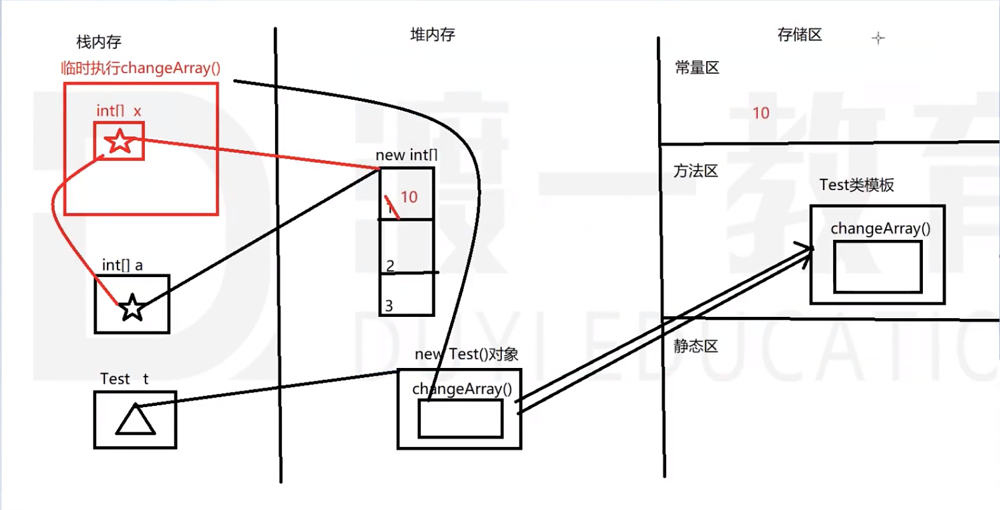

## 构造方法
```java
// 权限修饰符  类型一致的方法名([参数列表])[异常]{}
public Class Person {
   public String name;

   public Person() {}
   // 构造方法重载
   public Person(String name){
      this.name = name;
   }
}

// 通过new调用
Person p = new Person();
```
每个类都有构造方法，若在自己定义的类中没有定义，系统会默认提供一个无参数的构造方法。

若在自己的类中定义了构造方法，则默认无参的构造方法即被覆盖

构造方法
## 类属性
```java
/*权限修饰符 [特征修饰符] 数据类型 属性名字[ = 值]*/
public String name;
```

## 类方法
```java
// 权限修饰符 [特征修饰符] 返回值类型 方法名字([参数列表]) [抛出异常][{
//    [方法体]
// }]
```
类方法存储在**堆内存**的对象空间内。

类方法是在**栈空间**内执行的

形参与实参

形参可以理解为是方法执行时的临时变量空间(x)

实参可以理解为是方法调用时传递进去的参数(a)

方法调用时会将实参的内容传递给形参
1. 如果内容是基本类型，传递 - 值    形参改变，实参未变
2. 如果内容是引用类型：传递 - 引用  形参改变，实参也跟着改变


## 方法重载 - overload
1. 一个类中的一组方法，方法名相同，参数列表不同，构成了方法重载
2. 参数列表的不同：
   1. 参数的个数
   2. 参数的类型
   3. 参数的顺序
3. 动态参数列表
   ```java
   public void test(int ...x); // √ 类型固定，个数不固定[0...n], 本质上是一个数组int[] x;但不能与int[] x构成重载
   public void test(int a, int ...x); // √
   public void test(int[] x); // ×；与第1个冲突
   ```
   动态参数列表(```int ..x```)不能与```int[] x```不能构成重载。这两个本质上都是数组。

   区别：动态参数列表的方法，可以不传参数(相当于空数组)；数组的方法必须传递参数
## 程序块
1. 作用：跟普通方法一样
2. 写法：可以认为程序块是一个没有修饰符、没有参数、没有返回值、没有名字的特殊方法
   ```java
   public class Person {
      public String name;
      public constructor(String name) {
         this.name = name;
      }

      public String getName() {return this.name;}

      // 程序块
      {
         System.out.println("这是Person类的一个程序块");
      }
   }
   ```
3. 用法：程序块也需要调用才能执行（我们自己调用不到-没有名字）
   每一次我们调用构造方法之前，系统会帮助我们自动的调用一次程序块，让他执行一遍。

4. 类中可以有多个程序块
5. 使用场景：需要在创建对象之前（constructor）执行
## this关键字
1. this是一个关键字，代替的是某一个对象（当前调用属性或方法时的那个对象）
2. this可以调用属性、方法及**构造函数**
3. 可以在一个构造方法内通过```this()```调用另一个构造方法（省略了构造方法的名字）。必须在另一个构造方法内调用，必须在程序的第一行。
4. 构造方法、一般方法是有顺序的，认为构造方庄早于一般方法。
5. 不能在一般方法内调用构造方法
6. 构造方法可以重载
