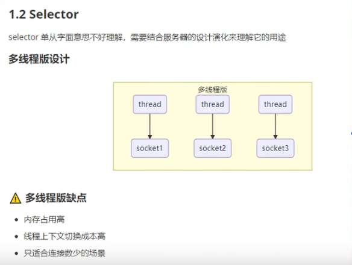
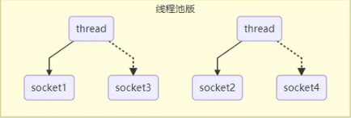
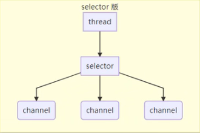
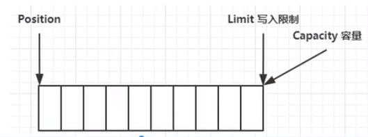
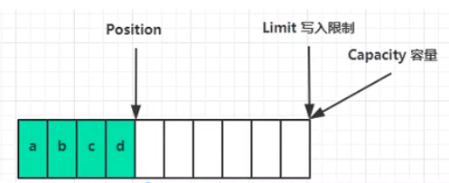
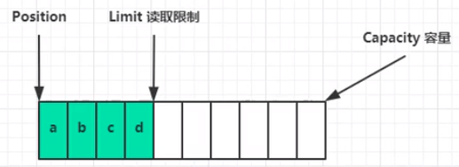
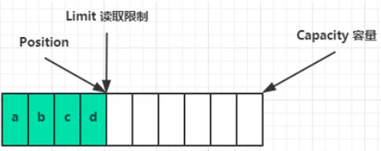

# Netty
## NIO基础
```non-blacking io(非阻塞IO)```
### 1. 三大组件
#### 1.1 Channel & Buffer
```channel```有一点类似于```stream```，它就是读写数据的**双向通道**，可以从```channel```中将数据读入```buffer```，也可以将```buffer```中的数据写入```channel```，而之前的```stream```要么是输入，要么是输出，```channel```比```buffer```更为底层

常见的```channel```:

1. ```FileChannel```
2. ```DatagramChannel```
3. ```SocketChannel```
4. ```ServerSocketChannel```
   
```buffer```则用来缓冲读写数据，常见的```buffer```有

1. ```ByteBuffer```
   * ```MappedByteBuffer```
   * ```DirectByteBuffer```
   * ```HeapByteBuffer```
2. ```ShortBuffer```
3. ```LongBuffer```
4. ```FloatBuffer```
5. ```DoubleBuffer```
6. ```CharBuffer```
#### 1.2 Selector
一、多线程版设计

缺点：
1. 内存占用高
2. 线程上下文切换成本高
3. 只适合连接数少的场景


二、线程池版


缺点：
* 阻塞模式下，线程仅能处理一个socket连接
* 仅适合短连接场景

三、selector版
* ```selector```的作用就是配合一个线程来管理多个```channel```上发生的事件，这些```channel```工作在**非阻塞**模式下，不会让线程吊死在一个```channel```上，适合连接数特别多，但流量低的场景(low traffic)
* 调用```selector```的```select()```会阻塞直到```channel```发生了读写就绪事件，这些事件发生，```select```方法就会返回这些事件交给```thread```来处理
  


### 2. ByteBuffer
```ByteBuffer```有以下重要属性
* capacity
* position
* limit
  
初始时



写模式下，```position```是写入位置，```limit```等于```capacity```



```flip```动作发生后，```positon```切换为读取位置，```limit```切换为读取限制


```clear```动作发生后


```compact```方法，是把未读的部分向前压缩，然后切换到写模式




  