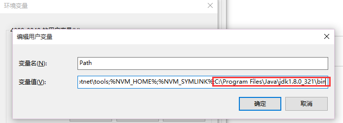
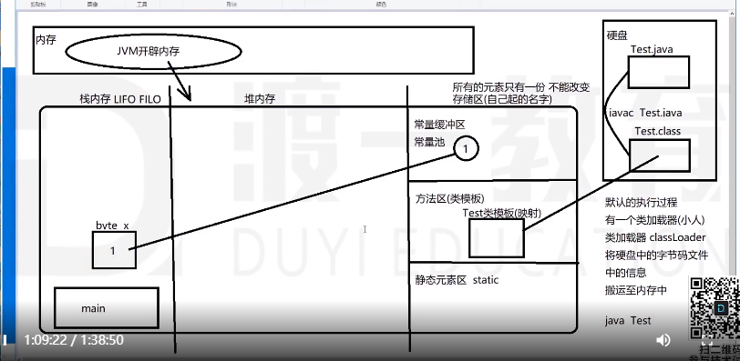

# java-notes
## Java历史
1. Java创始人 James-Glsling
2. Java语言公司 SUN Standford University NetWork ---> SUN Microsystems
3. Java语言的几个重大事件
   1995 正式发布
   1996 正式发布了可以下载的JDK工具包 JDK1.0
   1999 发布第二代Java平台 简称Java2 细化三个不同的版本
    标准版  Standard Edition    J2SE
    企业版  Enterprise Edition  J2EE
    微型版  Micro Edition   J2ME
   2004 JDK1.5版本  添加了很多新的特性  Java5
   2005 Java6版本
   2009 Oracle公司收购SUN
## JVM(Java Virtual Machine) java虚拟机
 源文件.java -> 字节码.class
## JRE(Java Runtime Environment)运行环境
JRE包含JVM
## JDK(Java Development Kit)开发工具包
JDK包含JRE
## 配置环境变量

## 数据类型
### 8个基本类型
4个整型：

1. byte(1 byte = 8 bit(0 0000000))     -128 ~ +127
2. short(2 byte)            -32768 ~ 32767
3. int(4 byte)
4. long(8 byte)
   
2个浮点型
1. float(4 byte)
2. double(8 byte)

1个字符型
1. char(1 byte) _中文两个字节，unicode编码(java默认编码:0-65535)_

1个布尔型
1. boolean(1 bit)
### 引用数据类型
1. 数组([])
2. 类(class)
3. 接口(interface)
4. 枚举(enum)
5. 注解(@interface)
## 常量
**常量**是程序运行过程中，不能两次改变的**值(基本数据类型)**

eg:
```java
final int UP = 1;
```
## 变量
**变量**是程序运行过程中可以被改变的。

变量是一个内存空间（小容器）

变量空间在创建（声明）的时候，必须指定数据类型和变量空间的名字

变量空间里面只有存储一个值或引用。

变量声明：数据类型 变量名字

eg: 
```java
    int age;
```
## 注释
1. 单行注释
   ```java
   // 
   ```
2. 多行注释
    ```java
   /*

   */
   ```
3. 文档注释
   ```java
   /**

   */
   ```
## 代码执行流程与内存变化

## 数据类型转换
1. 同种数据类型之间是可以直接进行赋值操作
   ```java
   int a = 1; int b = a;
   float a = 3.4; float y = x;
   ```
2. 数据类型不同的空间之间的赋值--转换问题
   同种大数据类型之间才能发生转换
   基本类型 ---- 基本类型之间，可以直接转换（自动、强制）
   引用类型 ---- 引用类型之间，可以直接转换（自动、强制--转型、下转型）
   基本类型 ---- 引用类型之间，不可直接转换（直接--包装类/封装类）
3. 保证大数据类型一致的前提下
   
   基本类型 -- 基本类型
    
      * 小数据类型相同
    
     都是整型、浮点型(比较内存空间大小)
    
     大空间变量可以直接存储小空间的数据
     小空间可以直接存储大空间的数据（需要强制类型转换）
      ```java
      byte a = 1; int b = a; // 自动类型转换
      int c = 1; byte d = (byte)a // 强制类型转换

      float x = 3.4F; double y = x; // 自动类型转换
      double x = 3.4; float y = (float)x; // 强制类型转换

      // 如果发现转换前的值比较大 强制转换是可以的
      int a = 1000; byte b = (byte)a;

      int a = 1;
      float b = a; // b = 1.0

      long a = 1;
      float b = a; // 比较的是精确度

      float a = 1.6F;
      int b = (int)a; // b = 1;(砍掉小数部分，而不是四舍五入)
     ```
   * 小数据类型不同
  
        整型 -- 浮点型

        两个比较的是精确度，浮点型精确度更高，可以直接存放整数，反之需要强制转换。

        任何一个浮点型都可以直接存放一个整型。

        字符 -- 整型
        
        每一个字符都对应这样一个Unicode码 a -- 97
        ```java
        char x = 'a'
        int y = x; // y = 97

        int x = 97;
        char y = (char)x; // x = 'a'
        ```
    * 布尔类型很特殊，不能与其他基本类型之间发生转化。

## Java运算符
1. 分类
   1. 按操作数的数目来进行分类
   
        单目运算符: a++

        双目运算符: a + b

        三目运算符: a > b ? x : y
   2. 按照运算符的功能来分类
   
        算术运算符: + - * / % ++ --
  
        赋值运算符: = += -= *= /= %=
        ```java
        byte x = 1; // 1是常量(32bit), 自动转化成byte类型
        x += 2; // x = 3; // x+2结果是32bit，自动转化成byte类型

        /**
        * 编译出错：类型从int转化成byte可能有损失
        * x(byte)变量空间的值取出；从常量区取出2(int)，做加法运算；结果是int；重新存到x(byte)空间会有问题。需要强制类型转换
        */
        x = x + 2; 
        ```

        关系运算符（比较）

        逻辑运算符

        位运算符
   3. 

            
