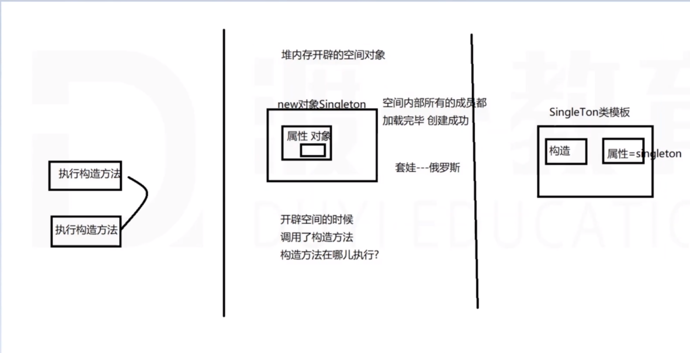

# 设计模式
## 概述
### 创建型模式（5种）    用于解决对象创建的过程
1. 单例模式
2. 工厂方法模式
3. 抽象工厂模式
4. 建造者模式
5. 原型模式
### 结构型模式（7种）
1. 适配器模式(Adapter)
   1. 缺省适配器
   ```java
   // 接口
    public interface Box {
        public boolean add(int element);
        public boolean add(int element, int index);
        public  void addAll();
        public int get(int index);
        public int remove(int index);
        public int getSize();
    }
   ```
   ```java
   // 缺省适配器
   public abstract class AbstractBox implements Box {
        public abstract boolean add(int element);
        public boolean add(int element, int index) {
            // 抛出异常，子类若需要，必须自己重现
            throw new RuntimeException("若需要，必须自己重写");
        }
        public void addAll() {
            // 抛出异常, 子类若需要，必须自己重现
            throw new RuntimeException("若需要，必须自己重写");
        }
        public abstract int get(int index);
        public abstract int remove(int index);
        public abstract int getSize();  
    }
   ```
   ```java
   // 使用方式
   public class ArrayBox extends AbstractBox{
        public boolean add(int element) {
            // 1.确保数组内容量足够
            // 2.将element元素存入数组的最后位置，数组实际长度size++
            // 3. 返回true告诉用户add成功
        }

        public int get(int index) {
            // 1. 检查index合法性
            // 2. 将index位置的元素从数组中取出并返回
        }

        public int remove(int index) {
            // 1. 检查index合法性
            // 2. 获取index位置的元素，并保留起来
            // 3. 从index开始到size-1位置，将元素逐一前移覆盖
            // 4. 最后有效的那个元素删除掉并把数组长度size--
            // 5. 将保留的旧元素返回
        }

        public int getSize() {
        }
    }
   ```

2. 装饰者模式
3. 代理模式
4. 外观模式
5. 桥接模式
6. 组合模式
7. 享元模式
### 行为模式（11种）
1. 观察者模式
2. 策略模式
   
   用来解决执行流程固定，执行结果由于**提供了不同的策略**而不同。
   ```java
   /**
   * 银行类
   *   业务办理(人) {
   *        欢迎用户进来
   *        叫号
   *        办理
   *        离开
   *        欢迎下次再来
   *   }
   */

   /**
   * 人类（抽象）- 提供策略
   * 人（具体类）- 实现策略
   *
   *
   */
   ```
3. 模板模式
4. 责任链模式
5. 解析器模式
6. 迭代子模式
7. 命令模式
8. 状态模式
9.  备忘录模式
10. 访问者模式
11. 中介者模式
## 详解
### 单例模式（Singleton）
1. 一个类只能创建一个对象，有效减少内存占用空间
   ```java
   // MySingleton.class
   public class MySingleton {
        
        // 1. 让构造方法变成私有 - 保证外面不可以随便创建该对象
        private MySingleton() {

        }

        // 2. 单例（私有）
        private static MySingleton singleton = new MySingleton();

        // 3. 提供访问方法
        public static Singleton getSingleton() {
            return MySingleton.singleton;
        }

   }

    public class MySingleton {
        
        // 1. 让构造方法变成私有 - 保证外面不可以随便创建该对象
        private MySingleton() {

        }

        public static final singleton = new MySingleton();

   }

    // Test.java
    public class Test {
        public static void main(String args[]) {
        }

    }
   ```
2. 正确示例
3. 错误示例
   